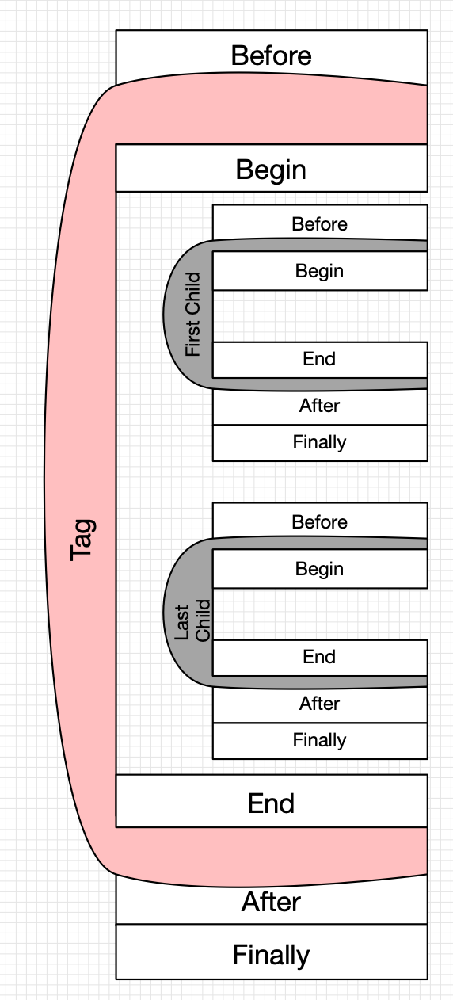

# Topology transformations

Beware cycles!

- Before: where execution happened before entering into this tag
- Begin: where execution is expected to be in the beginning of this tag

Usually tags handle their beforePaths: inject pathway from location Before to location Begin, to ensure that execution can get there.

- End: where execution is expected to end when all the children of the tag are executed
- After: where execution flow should go after this tag is handled

Usually Before == previous End or parent's Begin, and After == next Begin or parent's After.

- Finally: either After, if tag takes care of getting from its internal scope to the outer scope, or End if it doesn't

Usually tags do not care about the afterPath and inject nothing. But in some cases this path is super necessary, e.g. returning from the Par branch must be done within that Par branch, as doing it later is too late.

| Tag        | Before                  | Begin              | End                | After                       | Finally                           | Force Exit       |
|------------|-------------------------|--------------------|--------------------|-----------------------------|-----------------------------------|------------------|
| Default    | parent.begin OR _path_  | _path_             | **<-** begin       | **<-** ends                 | force ? **<-** after: **<-** ends | _false_          | 
| seq        | -                       | -                  | lastChild.finally  | -                           | -                                 | -                |
| seq/*      | prev.finally OR default | -                  | -                  | next.begin OR parent.after  | -                                 | -                | 
| xor/*:0    | -                       | -                  | -                  | parent.after                | -                                 | hasExecLater     |
| xor/*:1    | prev.ends               | -                  | -                  | parent.after                | -                                 | hasExecLater     | 
| xor        | -                       | -                  | lastChild.finally  | -                           | -                                 | -                |
| par/*      | -                       | -                  | **<-** before      | parent.after                | -                              | exportsUsedLater | 
| for        | -                       | fc.begins(until i) | -                  | -                           | -                                 | -                | 
| noExec     | -                       | -                  | **<-** begin       | -                           | -                              | -                | 

